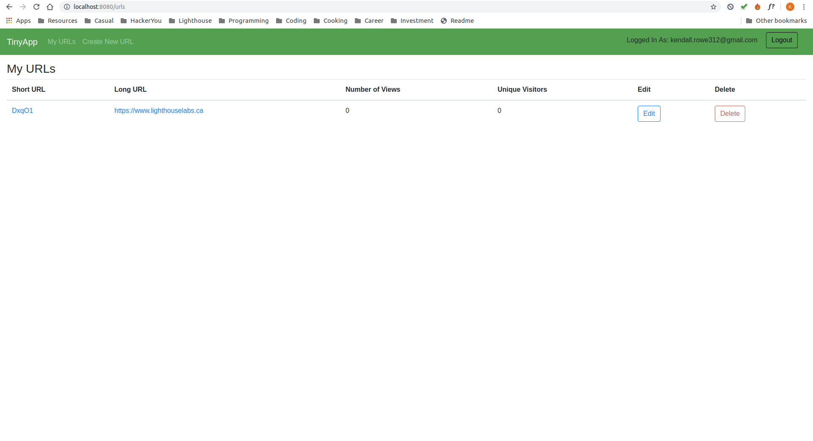
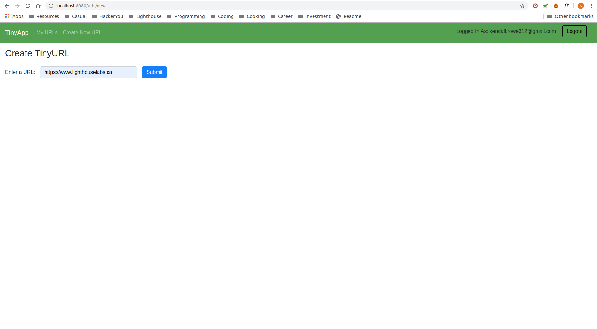
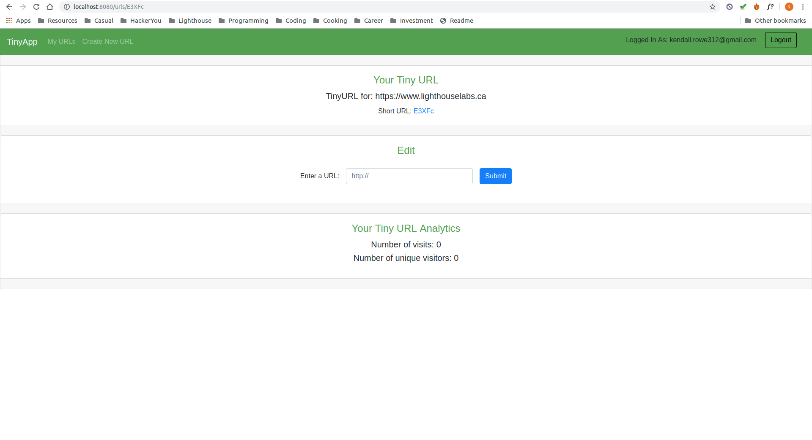
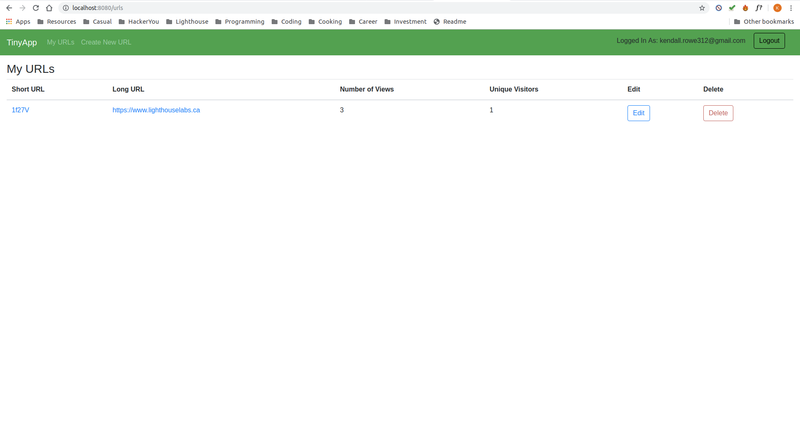

# TinyApp Project

TinyApp is a full stack web application built with Node and Express that allows users to shorten long URLs (à la bit.ly).

## How to Use

1. Home page for logged in user before creating any URLS. Select 'Create New URL' in header to create your first URL!
2. Create new Tiny URL page by filling out the form with your original long URL and pressing Submit.
3. You can view and edit your created URL as you like! In order to use it, simply click the shortURL link provided. You can allow anyone to view your site simply by visiting: http://localhost:8080/u/#YOURSHORTURLHERE#
4. Home page for logged in user after creating URLS

## Dependencies

- Node.js
- Express
- EJS
- bcrypt
- body-parser
- cookie-session

## Getting Started

- Install all dependencies (using the `npm install` command).
- Run the development web server using the `node express_server.js` command.